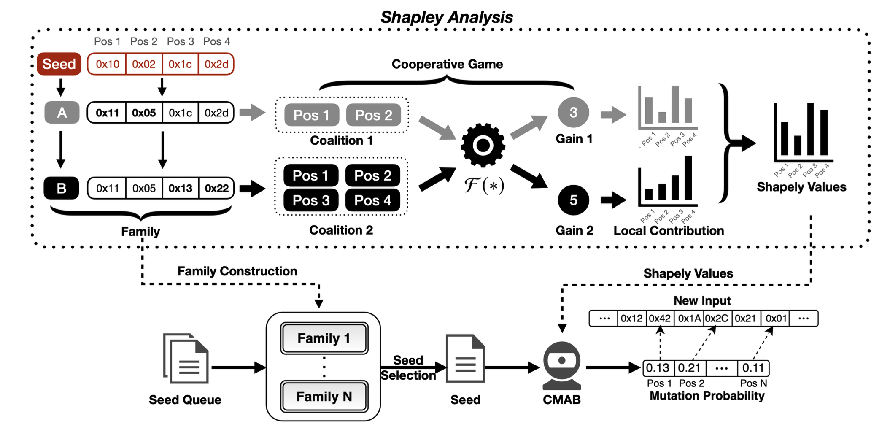

# ShapFuzz

## Description
ShapFuzz is a novel fuzzer that aims to increase code coverage with a Shapley-guided byte schedule.
ShapFuzz formulates byte mutation as Shapley analysis, and gather seeds into a family based on the formulation. 
To improve the performance of Shapley-guided mutation, ShapFuzz utilizes a contextual multi-armed bandit approach to optimize the use of Shapley values.

<p align="center">
<kbd>

</kbd>
<br>The framework of ShapFuzz.
</p>

## Usage
Same steps as [AFL++](https://github.com/AFLplusplus/AFLplusplus), in addition:
1. add "-w" to perform Shapley-guided mutation.

To use the ShapFuzz strategy, you can run the following command.
```
./ShapFuzz/afl-fuzz -i $input -o $output -m none -w -- /path/to/program [...params...]
```

If you want to achieve better results, you can combine the ShapFuzz mutator and the Redqueen mutator.
```
./ShapFuzz/afl-fuzz -i $input -o $output -c /path/to/program.cmplog -m none -w -- /path/to/program.afl [...params...]
```
`program.cmplog` is the CmpLog binary built with setting AFL_LLVM_CMPLOG during the compilation.

## Advantages
1. ShapFuzz models byte mutation from the perspective of Shapley value and utilizes Shapley value to quantify the contribution of each byte.
2. ShapFuzz can determine which bytes are important through Shapley values without the need for additional instrumentation (such as taint analysis) or extra analysis before mutating seeds (such as greyone).
3. ShapFuzz can be used in conjunction with other mutators in AFL++ (such as the RedQueen mutator) to achieve better results.

## Limitations
In the paper, we formulate the process of byte mutation as a cooperative game and use Shapley value to quantify the contribution of each byte. However, if we strictly follow the calculation formula of Shapley value, it will lead to the issue of excessive overhead. Therefore, we simplified the calculation as follows:
1. To reduce the overhead of calculating Shapley values, the seeds in a family share the same Shapley values. However, despite implementing a strict family construction method (seeds with genetic relationships and the same lengths), there may still be cases where the semantics between seeds are inconsistent.
2. In our experiments, we found that in most cases, discovering self-new edges requires mutations at multiple positions simultaneously. In other words, if any position among the mutated positions lacks a mutation, it will only discover 0 self-new edges. Therefore, to simplify the calculation of Shapley values, we categorize mutated bytes into two parts: redundant bytes and necessary bytes. For necessary bytes, we consider them equivalent, meaning they have the same $\phi_p$ (used to update Shapley values), thus simplifying the calculation.
3. In updating the Shapley value of a family, we pay more attention to the latest mutated positions, considering these bytes more effective in subsequent mutations. Therefore, we only consider the latest mutated positions to calculate their $\phi_p$ and use them to update the Shapley values.

## Evaluation
The version of AFL++ we used in the experiment is: [AFL++ commit:c7bb0a9638a8929a5b664f16032c23a55a84be70](https://github.com/AFLplusplus/AFLplusplus/commit/c7bb0a9638a8929a5b664f16032c23a55a84be70).


## Update Log
1. 2023.07: To alleviate potential issues arising from "The Impact of Self-New Edges" and "Semantic Consistency Within Families," we updated the usage of CMAB as follows: (1) We set the reward as the rarity of the path exercised by the mutated input. (2) We updated the calculation formula for $Score(s, p)$ to $Score(s,p) = E[r_{s, p}|f_{s}] + 0.5 U_{s,p} + \phi_p$.

2. 2024.01: Deleted some unnecessary test code.

## Citation
```
@article{zhangshapfuzz,
  title={SHAPFUZZ: Efficient Fuzzing via Shapley-Guided Byte Selection},
  author={Zhang, Kunpeng and Zhu, Xiaogang and Xiao, Xi and Xue, Minhui and Zhang, Chao and Wen, Sheng},
  booktitle={The Network and Distributed System Security Symposium},
  year={2024}
}
```